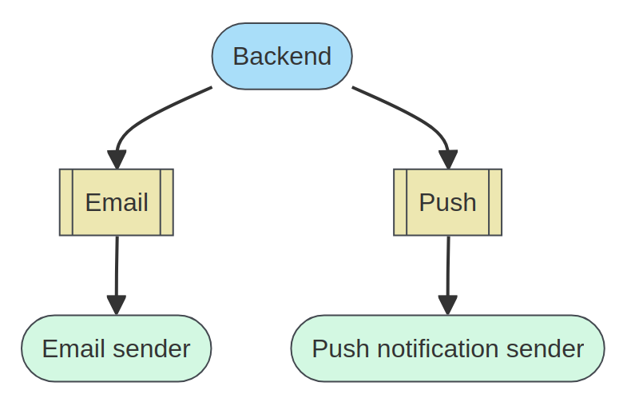
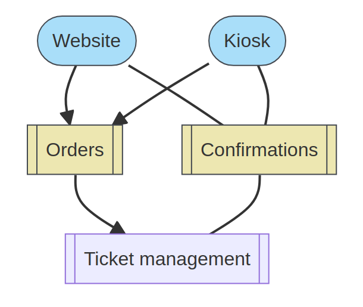
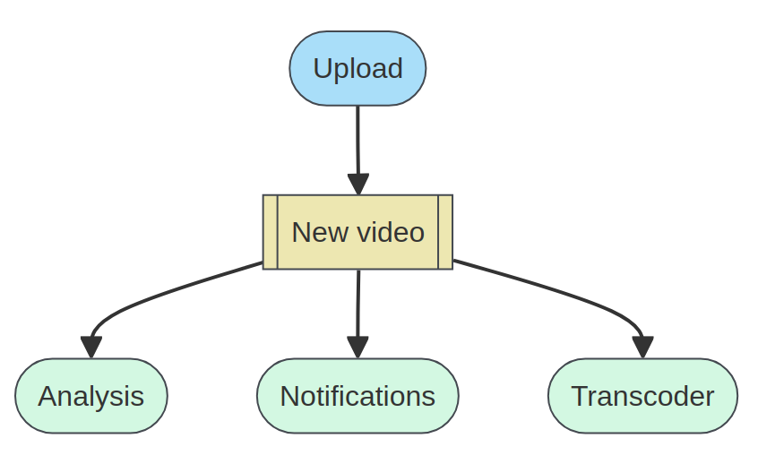
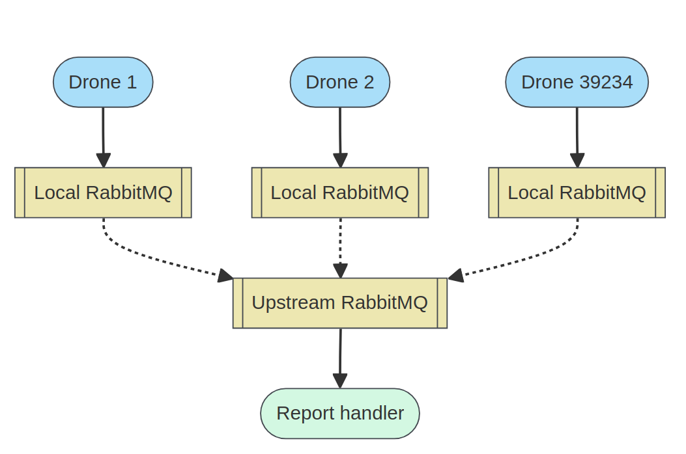

# RabbitMQ

RabbitMQ is an open-source `message-broker` software (sometimes called `message-oriented middleware`) that originally implemented the `Advanced Message Queuing Protocol (AMQP)` and has since been extended with a plug-in architecture to support `Streaming Text Oriented Messaging Protocol (STOMP)`, `MQ Telemetry Transport (MQTT)`, and other protocols.

It is written in `Erlang` Language, the RabbitMQ server is built on the `Open Telecom Platform framework` for clustering and failover. Client libraries to interface with the broker are available for all major programming languages. The source code is released under the `Mozilla Public License`.

Since November 2020, there are commercial offerings available of RabbitMQ, for support and enterprise features: "VMware RabbitMQ OVA", "VMware RabbitMQ" and "VMware RabbitMQ for Kubernetes" (different feature levels) Open-Source RabbitMQ is also packaged by Bitnami and commercially for VMware's Tanzu Application Service. 

To know more about Message Queue

https://github.com/shubhammishra-go/Message-Queue

## History

Originally developed by `Rabbit Technologies Ltd`. which started as a `joint venture between LShift and CohesiveFT in 2007`, RabbitMQ was acquired in April 2010 by `SpringSource`, a division of `VMware`. 

The project became part of Pivotal Software in May 2013. Which then got acquired back by VMWare in December 2019.

The project consists of: 

- The RabbitMQ exchange server
    
- Gateways for AMQP, HTTP, STOMP, and MQTT protocols

- AMQP client libraries for Java, .NET Framework and Erlang. (AMQP clients for other languages are available from other vendors.)

- A plug-in platform for extensibility, with a predefined collection of supported plug-ins, including:
        
- - A "Shovel" plug-in that takes care of moving or copying (replicating) messages from one broker to another.

- - A "Federation" plug-in that enables efficient sharing of messages between brokers (at the exchange level).

- - A "Management" plug-in that enables monitoring and control of brokers and clusters of brokers.

## Which protocols does RabbitMQ support?

RabbitMQ supports several messaging protocols, directly and through the use of plugins. 

- `AMQP 0-9-1 and extensions`

RabbitMQ was originally developed to support AMQP 0-9-1. As such this protocol is the "core" protocol supported by the broker. All of these variants are fairly similar to each other, with later versions tidying up unclear or unhelpful parts of earlier versions. We have extended AMQP 0-9-1 in various ways.

AMQP 0-9-1 is a binary protocol, and defines quite strong messaging semantics. For clients it's a reasonably easy protocol to implement, and as such there are a large number of client libraries available for many different programming languages and environments.

AMQP 0-9-1 is the protocol used by `RabbitMQ tutorials`.

- `Streaming Text Oriented Messaging Protocol (STOMP)`

STOMP is a text-based messaging protocol emphasising (protocol) simplicity. It defines little in the way of messaging semantics, but is easy to implement and very easy to implement partially (it's the only protocol that can be used by hand over telnet).

RabbitMQ supports STOMP (all current versions) via a `plugin`.

- `Message Queue Telemetry Transport (MQTT)`

MQTT is a binary protocol emphasising lightweight publish / subscribe messaging, targeted towards clients in constrained devices. It has well defined messaging semantics for publish / subscribe, but not for other messaging idioms.

RabbitMQ supports MQTT versions 3.1, 3.1.1, and 5.0 via a `plugin`.

- `AMQP 1.0`

Despite the name, AMQP 1.0 is a radically different protocol from AMQP 0-9-1 / 0-9 / 0-8, `sharing essentially nothing at the wire level`. `AMQP 1.0 imposes far fewer semantic requirements`; it is therefore easier to add support for AMQP 1.0 to existing brokers. The protocol is substantially more complex than AMQP 0-9-1, and there are fewer client implementations.

RabbitMQ supports AMQP 1.0 via a `plugin`.

- `HTTP and WebSockets`

While HTTP is not really a messaging protocol, RabbitMQ can transmit messages over HTTP in three ways:

- - The Web STOMP plugin supports STOMP messaging to the browser using WebSockets.

- - The Web MQTT plugin supports MQTT messaging to the browser using WebSockets.

- - The management plugin supports a simple HTTP API to send and receive messages. This is primarily intended for diagnostic purposes but can be used for low volume messaging without reliable delivery.

- `RabbitMQ Streams`

The RabbitMQ Streams protocol allows communicating with streams. RabbitMQ supports the streams protocol via a `plugin`.

# Why RabbitMQ?

RabbitMQ is a reliable and mature messaging and streaming broker, which is easy to deploy on cloud environments, on-premises, and on your local machine. It is currently used by millions worldwide.

- `Interoperable` able to exchange and make use of information.

RabbitMQ supports several open standard protocols, including `AMQP 1.0` and `MQTT 5`. 

There are multiple client libraries available, which can be used with your programming language of choice, just pick one. No vendor lock-in!

- `Flexible` able to be easily modified to respond to altered circumstances.

RabbitMQ provides many options you can combine to define how your messages go from the publisher to one or many consumers. `Routing`, `filtering`, `streaming`, `federation`, and so on, you name it.

- `Reliable` consistently good in quality or performance; `able to be trusted`.

With the ability to acknowledge message delivery and to replicate messages across a cluster, you can ensure your messages are safe with RabbitMQ.

# Examples of Common use cases

Here are a few common use cases of RabbitMQ

- `Decoupling interconnected services`

You have a backend service that needs to send notifications to end users. There are two notification channels: emails and push notifications for the mobile application.

The backend publishes the notification to two queues, one for each channel. Programs that manage emails and push notification subscribe to the queue they are interested in and handle notifications as soon as they arrive.

// Benefits

RabbitMQ absorbs the load spike.
    
You can do some maintenance on the notification managers without interrupting the whole service.

- `Remote Procedure Call`

You own a concert hall. Tickets for the shows are sold on multiple websites and physical kiosks. Orders from all channels must go through a complex process to determine if a customer effectively get their tickets, depending on availability. The website or kiosk expect to get an answer for the order in minimal time.

Orders are published to a queue in RabbitMQ with a correlation ID. The caller that pushed the order then subscribes to another queue and waits for an answer with that same correlation ID.

To achieve low latency, a classic queue is a good fit here but it is at the expense of less safety — the caller can still retry. If the order cannot be lost, you might prefer to use a combination of acknowledgments and quorum queues to ensure a message is safe once confirmed.

This topology allows the processing of orders to be serialized to serve them in a first come first served order. This avoids the need for transactions.

// Benefits

A RabbitMQ client can be a publisher and a consumer at the same time.

RabbitMQ can be used to `dispatch RPC calls`.

- `Streaming`

You run a video platform. When a user uploads a new video, you have multiple tasks to complete when the video is safely stored: run some post-upload analysis, transcode lower quality copies of the video, notify other users subscribed to the author's creations, and so on.

The upload service appends “New video” events to a RabbitMQ stream. Multiple backend applications can subscribe to that stream and read new events independently of each other. Users must be notified right away, but the post-upload analysis can wait and run once a day.

// Benefits

Streams are very efficient and avoids the need to duplicate messages.
    
A consumers can go back and forth in the stream even if there are concurrent consumers.

- `IoT`

You provide package delivery services across the entire galaxy. You have a swarm of space drones that need to report their status on a regular basis to a server hosted on exoplanet Kepler-438 b. Unfortunately, the network connectivity is not great…

Each space drone runs a local RabbitMQ standalone node that buffers their report until a connection is possible with the upstream RabbitMQ.

When planets are aligned, the drone's RabbitMQ shovels all reports to the upstream RabbitMQ.

// Benefits

RabbitMQ deployments can be chained to cater for different needs in your service, using features such as shovels and federation.

MQTT is well suited for millions of concurrent connections.

# Kafka vs RabbitMQ

...

